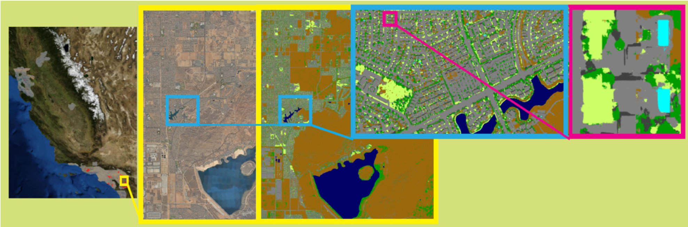

# landcover-classification-101

Get started with landcover classification using machine learning and satellite or aerial imagery. This interactive material was presented at the University Washington's Geohackweek 2018.

For tutorial, see the [notebook in this repo](https://github.com/vega5b/landcover-classification-101/blob/master/demo_landclassification.ipynb).

## Perform Land Classification using Supervised Machine Learning in 10-ish Steps

### Goal

In this tutorial, you will work with nadir-looking imagery to run supervised machine learning models to perform land classification. From this excersize, you will:

* gain insight into setting up a geospatial machine learning model,
* understand differences in imagery types,
* create testing and training data for supervised modelling,
* evalaute performance against multiple model types,
* gain knowledge of streaming pixels from the cloud. </i>

### Background

Land classification is the technique of labelling each individual pixel in an image with its relevant class (e.g. water, road, tree, etc). In remote sensing, there is a long history of this process, largely driven by manual labor. With the rise of increased acquisition from digital sensor platforms, at high resolution, manual classification is unscalabile and can have inherent human biases. Machine learning is ideal for land classification in its ability to scale the pixel-wise labelling exponentially. A Support Vector Machine implementation is very straightfoward, and is discusssed here. However, for large-scale processing workflows, Convolutional Neural Networks (CNN) have become ideal.

Figure 1. RGB overhead imagery (left) is used in combination with truth data to perform a pixel-size land classification (far right), where each pixel is translated from an RGB value to a label class. In this case, the classes are pool (cyan), impervious surface (grey), tree/shrub (dark green), irrigated lawn (light green), shadows (dark grey), natural/non-irrirgated lawn (brown). This land classification map was produced using a deep learning Convolutional Neural Network.
